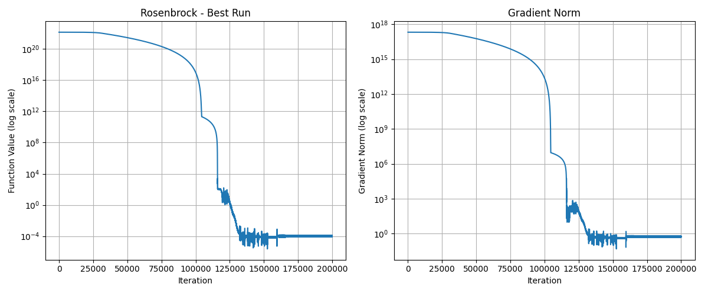

# Global Lorenz Chaos Optimizer

An optimization algorithm that combines Lorenz chaos theory with gradient descent to solve high-dimensional optimization problems.

## What It Is

The Global Lorenz Chaos Optimizer fuses **structured chaotic exploration** with **gradient-guided convergence** to tackle extreme optimization landscapes. Unlike traditional optimizers that rely purely on gradients, this approach uses a 3D Lorenz attractor to generate coordinated high-dimensional chaos flows, enabling both global exploration and local exploitation.

## Key Innovation

**Chaos-Gradient Fusion**: The algorithm blends chaotic flow vectors (for exploration) with normalized gradient directions (for exploitation), with adaptive weighting that automatically shifts from exploration to convergence based on optimization progress.

### Performance Highlights
- **Extreme Rosenbrock**: Solves 100D Rosenbrock with bounds [-50,000, 50,000] 
- **26+ Order Magnitude Convergence**: 10^22 → 10^-5 in ~160K iterations
- **Consistent Results**: Reproducible performance across multiple independent runs

### Automatic Adaptation
- **Self-tuning chaos strength**: Adjusts exploration vs exploitation dynamically
- **Adaptive step size**: Scales learning rate based on optimization progress  
- **Guidance strength adaptation**: Balances gradient following vs chaos exploration
- **No hyperparameter tuning**: Works out-of-the-box with minimal configuration

## How It Works

### Core Components

1. **Global Lorenz Chaos Engine**
   - Generates structured high-dimensional chaos from single 3D Lorenz attractor
   - Each dimension receives unique frequency-modulated combinations of Lorenz states
   - Provides coordinated exploration across full parameter space

2. **Gradient-Chaos Blending**
   ```python
   final_direction = (1 - guidance_strength) * chaos_flow + guidance_strength * gradient_direction
   ```

3. **Momentum Integration**
   - Smooths optimization trajectory for valley navigation
   - Critical for traversing narrow curved landscapes like Rosenbrock

4. **Adaptive Parameter Control**
   - Monitors improvement every 50 iterations
   - Adjusts chaos strength, guidance strength, and step size automatically

### Algorithm Phases

**Phase 1 (Exploration)**: High chaos strength explores massive search space  
**Phase 2 (Discovery)**: Detects promising regions, begins increasing gradient guidance  
**Phase 3 (Convergence)**: Low chaos, high gradient guidance for precise convergence  

## Empirical Validation on High-Dimensional Non-Convex Landscapes



*100D Rosenbrock optimization with bounds [-50,000, 50,000]:

### Rosenbrock Function Performance
- **Domain**: [-50,000, 50,000] per dimension
- **100D Problem**: Starting values ~10^22, converging to ~10^-5
- **Execution Time**: ~98 seconds per run
- **Consistency**: Multiple runs achieve similar high-precision results

### Current Limitations
- **Multimodal functions**: Struggles with functions like Rastrigin (many local minima)
- **Adaptive mechanisms**: Current parameter adaptation can be improved
- **Valley-type bias**: Optimized for Rosenbrock-like landscapes

## Usage

### Basic Usage
```python
from global_lorenz_optimizer import GlobalLorenzOptimizer

# Create optimizer
optimizer = GlobalLorenzOptimizer(dimension=100)

```

### Benchmark Testing
```python
from benchmark import BenchmarkSuite

suite = BenchmarkSuite()

# Test single function
result = suite.run_single_function('rosenbrock', 100, max_iterations=200000, runs=3)

# Test all functions  
all_results = suite.run_all_functions(100, max_iterations=20000, runs=2)

# Plot convergence
suite.plot_convergence(result)
```

## Available Benchmark Functions

The suite includes 11 standard optimization benchmarks:
- **Unimodal**: sphere, rosenbrock, zakharov, dixon_price
- **Multimodal**: rastrigin, ackley, griewank, schwefel, levy, michalewicz, styblinski_tang

## Future Directions

### Immediate Improvements
- Enhanced adaptive parameter scheduling for multimodal functions
- Improved chaos-gradient balance for different landscape types
- Optimized step size adaptation mechanisms

### Research Extensions
- **Neural Network Training**: Apply chaos control to replace backpropagation
- **Stochastic Optimization**: Extend to noisy gradient scenarios
- **OGY Control Integration**: Gradient-Free Stabilization via OGY Control:
Incorporate Ott-Grebogi-Yorke (OGY) control, a classical method for stabilizing chaotic systems near unstable periodic orbits, to dynamically regulate optimizer trajectories without gradient feedback. By observing state-space perturbations and applying minimal directional corrections, the optimizer could autonomously lock into high-value attractor basins—enabling chaos-guided convergence even in gradient-inaccessible or noisy environments. With this method we can also eliminate current sine based chaos projection mechanism.


## Dependencies

```
numpy
matplotlib
time
typing
```

## Files

- `global_lorenz_optimizer.py`: Core optimizer implementation
- `benchmark.py`: Comprehensive benchmark suite with 11 test functions
- `Rosenbrock.png`: Convergence visualization example

## License

MIT License - Feel free to experiment and extend this work.

---

*This optimizer represents early-stage research into chaos-guided optimization. Current performance demonstrates breakthrough capabilities on specific problem classes, with significant potential for improvement and extension to broader applications.*
